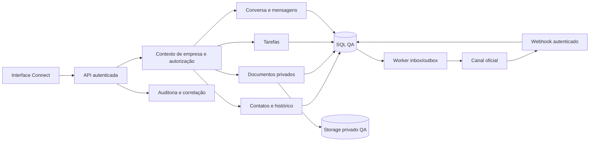

# Arquitetura candidata e fronteiras do recorte

Status: desenho para implementação futura. Fonte da direção: PDF fornecido e bases revisadas. A estrutura abaixo não afirma que pastas, serviços ou endpoints já existem na EBT Platform.

## Composição

Connect mantém a família .NET, React/TypeScript e SQL Server/Azure SQL da origem adequada, selecionada pela baseline. Comunicação usa inbox/outbox duráveis no SQL e worker no serviço; ver [desenho de API/webhook](CONNECT_API_E_WEBHOOK.md). Site/Flow estão adiados. O backend começa como monólito com fronteiras explícitas, sem exigir broker separado, cache distribuído ou microserviços.

O diagrama é candidato. Recebimento do webhook, fila de resposta, aceite do provedor e entrega são estados separados. Storage e identidade são interfaces/contratos da composição; credenciais não entram no domínio.

## Responsabilidade por fronteira

| Fronteira | Pode fazer | Depende de | Não deve fazer |
|---|---|---|---|
| Apresentação | Coletar entrada, mostrar contexto/erro/resultado | Contrato API e configuração de marca | Autorizar pelo simples desaparecimento de botão |
| Identidade/contexto | Resolver usuário, empresa, perfil e escopo válidos | Identidade autenticada e vínculo ativo | Confiar no TenantId editável do cliente |
| Aplicação | Coordenar caso de uso e transação | Domínio e interfaces | Espalhar autenticação ou storage em cada tela |
| Domínio do recorte | Preservar estados, invariantes e IDs | Dados autorizados do caso de uso | Dependência de UI ou provedor externo |
| Persistência | Garantir índices, vínculo, concorrência e atomicidade | Schema versionado e contexto | Copiar bancos reais para fixtures |
| Arquivos | Armazenar/recuperar binário privado por contrato | Metadado e autorização por recurso | Tratar key/URL como permissão suficiente |
| Auditoria | Registrar ator, empresa, operação e resultado confirmado | Identidade e correlação confiáveis | Registrar token, senha ou anexo sensível no evento |

## Regra de extração

O recorte só vira componente compartilhado quando tem origem/hash, contrato neutro suficiente para dois consumidores, configuração de marca/contexto, autorização e teste pertinente nos dois. Uma cópia de cada produto não satisfaz o critério. Nem tudo do Vikings deve virar entidade dinâmica; vínculo trabalhista permanece domínio específico quando não é comum ao CRM.

## Organização futura de código

Criar apenas diretórios/soluções necessários à primeira implementação autorizada. Candidatos: src/Ebt.Api, src/Ebt.Web, modules para capacidades extraídas, tests por tipo, infrastructure para configuração/runbooks aplicáveis. Os nomes são sugestões; P02-02 fecha caminhos reais e comandos. Não criar uma árvore de dezenas de módulos vazios para aparentar implementação.
