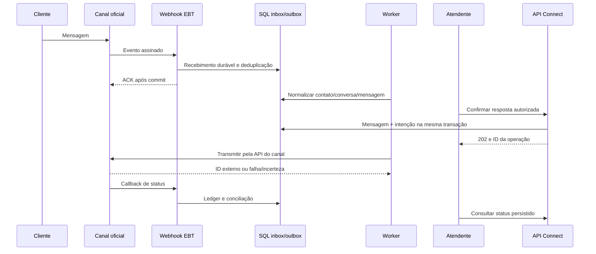

# EBT Connect: respostas por API e webhook

Execução autorizada em 07/10/2026: [estado real e provas](../qualidade/STATUS_IMPLEMENTACAO_CONNECT.md). Este documento preserva o plano/contrato candidato; não promover seus estados ou casos em lote.


Revisão em 07/10/2026. Este é um desenho e contrato candidato, com backlog P11 de 36h, não um serviço implementado. O usuário pediu que o fluxo de resposta fosse planejado com mais cuidado e autorizou pesquisar referências. WhatsApp oficial é o primeiro canal candidato escolhido nesta revisão técnica; a conta/provedor final e sua homologação ficam pendentes em P11-01.

## Como funciona para o atendente

O cliente manda uma mensagem. O Connect recebe o aviso pelo webhook e vincula a mensagem ao contato/conversa corretos. O atendente abre essa conversa, digita e confirma a resposta. A API registra a intenção; um worker transmite ao canal. Os callbacks atualizam os estados observados. A tela mostra conversa, responsável, rascunho, mensagem e motivo de falha sem obrigar o operador a entender detalhes técnicos.

Nota interna fica no histórico interno. Resposta externa tem ação própria. A primeira versão tem atendimento por responsável designado; distribuição inteligente, inbox coletivo avançado, campanhas, chatbot e outros canais ficam depois deste ciclo.

## Referências e decisão de arquitetura

Chatwoot documenta canal API com contato/conversa/mensagem, distinção incoming/outgoing e callbacks. Sua API cria mensagens dentro da conversa. É a referência de organização escolhida, sem copiar o produto inteiro, sua stack ou concluir que o nosso canal está homologado. [Canal API](https://www.chatwoot.com/hc/user-guide/articles/1677839703-how-to-create-an-api-channel-inbox), [criar mensagem](https://developers.chatwoot.com/api-reference/messages/create-new-message).

Stripe documenta duplicatas, ausência de ordem garantida e ACK rápido para seus webhooks. A recomendação EBT é receber com persistência durável e processar depois; as políticas de retry e resposta HTTP do provedor escolhido continuam específicas. [Webhooks Stripe](https://docs.stripe.com/webhooks).

Microsoft explica gravar objeto de negócio e outbox na mesma transação, inclusive em persistência relacional. Aplicaremos o padrão ao SQL do recorte; o exemplo consultado usa Cosmos DB e não obriga troca de banco. [Transactional Outbox](https://learn.microsoft.com/en-us/azure/architecture/databases/guide/transactional-out-box-cosmos).

Meta publica seus contratos de mensagens e status na coleção oficial. O SDK histórico da Meta documenta validação X-Hub-Signature-256; a configuração exata, versão e payload vigente serão confirmados em P11-01/P11-03. As páginas novas de developers.facebook.com tentadas nesta consulta retornaram erro de acesso; não foram tratadas como documentação lida. [Coleção Meta](https://www.postman.com/meta/whatsapp-business-platform/documentation/wlk6lh4/whatsapp-cloud-api), [payload de webhook](https://www.postman.com/meta/whatsapp-business-platform/folder/tduohwq/webhook-payload-reference), [assinatura no SDK histórico](https://whatsapp.github.io/WhatsApp-Nodejs-SDK/api-reference/types/webhookCallbackFunction/).

O desenho EBT usa .NET/React/SQL e um worker inicialmente no mesmo serviço, com inbox/outbox duráveis no SQL. Não exige Redis, broker separado ou microserviços neste recorte. CASST é fonte seletiva: cada contrato/componente precisa passar pela baseline. A insatisfação relatada pelo usuário não foi convertida em alegação de defeito técnico sem inspeção.

## Três respostas diferentes

| Resposta | Quem recebe | Significado |
|---|---|---|
| ACK HTTP do webhook | Provedor | Envelope autenticado foi armazenado; não é mensagem ao cliente |
| 202 da API do Connect | Interface/consumidor autorizado | Intenção de resposta persistida e enfileirada; ainda não entregue |
| Mensagem enviada pela API do canal | Cliente, se o canal a entregar | Texto externo; callbacks fornecem provas de status disponíveis |



## Modelo e fronteiras

ChannelConnection: tenant, provedor, conta/número/canal, versão, estado, referência segura de credencial. ContactChannelIdentity: contato interno e identificador opaco do remetente no escopo dessa conexão. Conversation: ID interno, contato, conexão, responsável, estado e versão. Message: conversa, direção, conteúdo autorizado, autor/origem, instante do evento e recebimento, ID externo e estado observado. WebhookReceipt/InboxEvent: hash/identidade do evento, versão, estado de processamento, tentativas e erro sanitizado. OutboxOperation: mensagem, chave/hash do comando, payload autorizado, lease, tentativa e resultado. DeliveryEvent: fato externo de status, referência externa e timestamps.

ID externo, telefone, ID interno do contato e ID da conversa são diferentes. Não unir cadastros de tenants distintos pelo telefone. O webhook resolve contexto por app/conexão e conta/número registrados, depois de autenticar o evento; TenantId do corpo não dá autoridade. A API exige permissão no contato/conversa e no canal. Admin técnico não recebe automaticamente conteúdo.

A assinatura é validada em tempo constante nos bytes originais, antes da desserialização com efeitos; segredo não aparece em logs. Handshake GET não autentica mensagens POST. Não exigir um header de timestamp que o provedor não emite; repetição legítima é tratada pelo ledger/dedupe. Limites de corpo, retenção, tamanho de texto, rate limit e prazos são parâmetros fechados em P11-01/P11-03, conforme contrato vigente.

## Contrato da resposta

Paths novos são propostas: POST /api/connect/v1/conversations/{conversationId}/messages, GET dessa coleção e GET /api/connect/v1/messages/{messageId}. O JSON da resposta recebe content, contentType=text e replyToMessageId opcional; não recebe tenant ou destinatário arbitrário. O servidor resolve canal/destinatário pelo recurso autorizado e confirma que replyTo pertence à mesma conversa.

Idempotency-Key e If-Match são obrigatórios para confirmar envio. Unicidade: tenant + conversa + ação + chave. Guardar hash canônico do comando e resultado. Mesma chave/payload recupera a operação; mesma chave com outro texto retorna 409; versão obsoleta retorna conflito; precondição ausente retorna 428. Destino sem sessão/permissão recebe erro seguro conforme a policy, sem enumerar IDs alheios. Paginação usa cursor estável e limite configurado no servidor.

Exemplo sintético de retorno inicial:

```json
{"messageId":"msg-qa-001","operationId":"op-qa-001","status":"queued","statusUrl":"/api/connect/v1/messages/msg-qa-001","version":"qa-v2"}
```

Erros próprios usam application/problem+json, code e traceId, sem texto sensível do provedor; seguir [RFC 9457](https://www.rfc-editor.org/info/rfc9457/). Códigos internos distinguem forbidden, stale_version, idempotency_mismatch, channel_unavailable, reply_policy_blocked e provider_result_unknown. Estratégia de sessão humana/credencial técnica deve ser fechada em P04; OpenAPI não implanta um mecanismo de autenticação.

## Recebimento e confirmação do webhook

Validar assinatura e envelope; armazenar recebimento e trabalho pendente; ACK somente após commit. Falha de persistência retorna erro transitório adequado ao provedor. Envelope pode conter várias entradas, changes, messages e statuses: percorrer todos os itens. Duplicata já durável recebe ACK sem nova mensagem. Mensagem usa chave tenant/conexão/provedor/ID externo; status usa identidade própria com referência, status e dados do evento, sem colapsar todos os callbacks da mensagem em uma única chave.

Evento autenticado de conexão desconhecida ou tipo não suportado fica em quarentena durável e gera diagnóstico; não inventa tenant, não envia resposta e não se perde em silêncio. Um envelope misto preserva os itens conhecidos e a quarentena de forma durável antes do ACK. Retenção do corpo bruto é minimizada e protegida, com política e acesso administrativo; não usar o corpo como log público.

Worker retoma eventos após restart. Alteração de conversa/mensagem e checkpoint de processamento têm limite transacional definido. Concorrência usa índice único e lease com fencing/versionamento; dois workers não geram duas mensagens ou duas operações por uma chave. Reprocessamento do ledger é auditado e não remove os registros que sustentam dedupe.

## Envio, callbacks e incerteza

Salvar mensagem e outbox no mesmo commit. Worker revalida conexão, permissão vigente e política de resposta antes de transmitir. Janela de atendimento, templates e identificadores permitidos são conferidos na documentação/conta do canal na homologação; custo, aprovação de template e infraestrutura não estão contratados por este plano. Texto livre bloqueado pela política permanece como rascunho/erro de ação e não é enviado fora das condições permitidas.

Estado interno queued indica fila. accepted significa aceite comprovado do provedor com referência externa. sent, delivered e read dependem dos callbacks específicos; ausência de read não prova falta de leitura. failed preserva erro sanitizado. unknown representa POST com resultado ambíguo. Guardar fatos/instantes recebidos; uma redução determinística preserva read/delivered já observados quando chega sent atrasado, e conflito de fatos fica registrado, sem simplesmente ordenar estados como números.

Callback pode chegar antes da resposta da API: guardar evento não conciliado por conexão/ID externo e conciliar quando o vínculo estiver disponível. IDs/status de outra conexão ou tenant não alteram mensagem. Retenção e alertas de eventos órfãos precisam ser definidos; não descartar porque ainda não existe a mensagem correspondente.

Idempotência da API EBT não garante idempotência da chamada externa. Se o canal não aceitar chave idempotente ou permitir consultar a operação incerta, timeout após POST exige unknown e reconciliação, sem resend automático. Mesmo erro 5xx pode ser ambíguo; adapter precisa distinguir rejeição comprovada de resultado desconhecido. Retry com backoff/jitter tem limite e só acontece quando é seguro pela semântica do provedor. Falha de processamento local é repetível com dedupe; ela é diferente de repetir um envio externo.

Replay/retry administrativo exige ação específica, contexto e trilha. Resolver mensagem desconhecida não cria chave nova silenciosamente; eventual reenvio é decisão explícita com risco de duplicata registrado. Reiniciar worker, restaurar banco ou clicar duas vezes não deve disparar nova mensagem por conta própria.

## Limites da primeira versão e testes obrigatórios

Somente texto, conversa ligada ao contato, um adapter e resposta confirmada pelo atendente. Projeto deixa contratos prontos para integrações autenticadas e para eventos próprios futuros. Webhook genérico de saída para destinos arbitrários, robôs, chatbot/IA, broadcast e integração de e-mail ficam fora desta implementação inicial.

P11-11/P11-12 devem provar entrada assinada, duplicata/lote, ordem invertida, callback antes do retorno, confirmação simultânea, perda de resposta, tenant A/B/carteira/ID direto, sessão revogada, política de canal, falha SQL, restart do worker, replay autorizado, restore com ledger/outbox e UI que conserva rascunho. Callback de status não gera nova resposta, evitando loop. Fixtures locais são próprias; homologação do canal exige prova no destino real de QA permitido. Sem acesso ao provedor, registrar capacidade local e manter G-MSG pendente.

## Encaixe nas 200h

CRM/tarefas: 104h acumuladas. Comunicação P11: 36h, fechando em 140h se todos os gates passarem. GED: 24h, até 164h. Candidato integrado: 16h, até 180h. Reserva: 20h. Site (12h) e Flow (24h) foram adiados para liberar as mesmas 36h; não foram declarados entregues nem apagados do backlog posterior.

36h é um timebox técnico de recorte, sem promessa de homologação externa ou prazo. Se acesso/canal ou generalização exigir mais, registrar estimativa real e priorizar a comunicação essencial; o GED pode ser recortado/adiado mediante replanejamento explícito. Não consumir a reserva em ampliação de canal. O marco de 140h é QA; liberação real requer G-RC e aceite próprios.

[OpenAPI candidato](../../planejamento/connect_api.openapi.json) | [Entrega Connect](../produtos/ENTREGA_EBT_CONNECT.md) | [P11](../execucao/fases/P11.md) | [Gates](../VALIDACAO_E_GATES.md)
