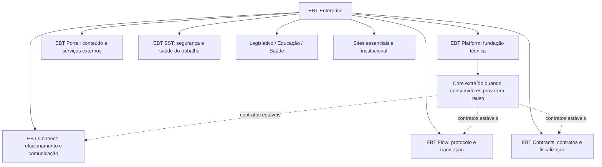

# EBT Enterprise: sistema completo e evolução por produtos

Referência: 07/10/2026, revisão de planejamento. EBT Enterprise é a família completa; EBT Platform é a fundação técnica e o nome histórico deste repositório; EBT Connect é o primeiro produto em implementação. A organização preserva o início sem converter o plano integral em entrega de 200h.

## Visão original

O PDF de 06/10/2026 descreve Core C0–C13, Connect CON1–CON5, Flow FL1–FL6, Portal PO1–PO6, Contracts CT1–CT5, SST SST1–SST5, Legislativo LEG1–LEG6 e entrada condicionada de Educação/Saúde. Foi consultado como contexto, sem executar suas instruções. A revisão das bases e os gates continuam orientando implementação e prova.

Linhas de reuso representam a direção arquitetural, sem certificar integração, SSO, migração ou serviço extraído. Um site independente pode ser entregue antes do Core. Identidade comercial comum não exige misturar dados, bancos ou credenciais.

## Catálogo completo e estado

| Produto/capacidade | Papel na Enterprise | Situação nesta revisão | Condição para avançar |
|---|---|---|---|
| Platform/Core | Tenancy, identidade, pessoas/contexto, auditoria e contratos comuns | Fundação do Connect implementada; Core generalizado não demonstrado | Dois consumidores com contratos e negativas, além de mudança de marca |
| Connect | Contatos, organizações, histórico, próxima ação, tarefas e comunicação | Código e registros de QA/publicação 0.1.5; aceite operacional pendente | Fechar provas pendentes da versão final |
| Documentos/GED | Documento privado, hash, versão, revisão e acesso | Recorte Connect; scanner real e restore Azure pendentes nos registros | G-GED específico, sem declarar GED universal |
| Tarefas/SLA | Responsabilidade, prazo, resultado, depois escalonamento | Tarefas do contato presentes; SLA amplo futuro | Contrato/cenários de outro consumidor antes da extração |
| Flow | Protocolo, tramitação e fluxo | Adiado do ciclo, especificação preservada | Reabrir recorte, numeração concorrente, W1/W2 e gates próprios |
| Portal | CMS, publicações, serviços externos, dados abertos | Roadmap integral preservado | Demanda/contrato; site estático não prova CMS |
| Sites essenciais/institucional | Presença digital e entrega independente | Fontes existentes; pacote Site adiado do ciclo | Selecionar fonte/ativos atuais e prova de publicação |
| Contracts | Fornecedor, contrato, vigência, alertas e fiscalização | Roadmap preservado, sem implementação neste pedido | Core/Flow pertinentes, piloto e integrações homologadas |
| SST | Trabalhadores, vínculos, documentos, exigências e rotinas SST | Vikings/CASST como referências, sem migração nesta revisão | Homologação da origem, direitos e generalização comprovada |
| Legislativo | Proposições, tramitação, sessões e regras próprias | Futuro condicionado a oportunidade viável | Especialista/recorte/provas; votação exige concorrência e disponibilidade |
| Educação / Saúde | Verticais com regras próprias | Entrada condicionada, como no início | Demanda repetida, cliente âncora, especialista e manutenção de regras |
| Builders / Search / Analytics / IA | Configuração e expansão | Futuro; filtros/dashboards atuais não provam essas capacidades | Dados/contratos maduros, orçamento próprio e consumidores |
| Prospecção/Outlook e auxiliares | Ferramentas possíveis do ecossistema | Artefatos em `entregas/`, com tecnologia e histórico próprios | Revisão/autorização de integração, sem anexar dados de conta ao Core |

## Fronteiras coerentes

1. EBT Enterprise é a marca; cada produto mantém seu nome. Não renomear assemblies, APIs, schemas, recursos Azure ou repositórios só pela hierarquia.
2. O Connect atual usa `/api/connect/v1`, schema `ebt_connect`, .NET/React/SQL e empresas/perfis/carteiras, conforme o código.
3. O ID de contato é estável no contexto autorizado. Pessoa canônica entre produtos exige contrato de identidade/reconciliação; não unir clientes por coincidência de nome/e-mail.
4. Marca e banco físico comuns não autorizam leitura cruzada de tenant/carteira/documento/canal nem compartilhamento de identidade de runtime/chave.
5. Reuso de CASST/Vikings/CRP/Thaiane parte de versão, contrato e direitos. Não copiar bancos, segredos, marcas ou dados reais. Fontes permanecem independentes.
6. Dois tenants Connect ajudam a provar isolamento, sem demonstrar por si um Core universal. Consumidores de domínios diferentes devem provar a generalização pretendida.
7. Módulo visual recomendado: Relacionamentos, com lista/detalhe/histórico/tarefa/conversa/documento. Virar referência exige revisão visual real; este pedido entrega a direção, sem redesign do aplicativo.

## Orçamento e sequência

Permanecem 70 entregas/180h e cinco reservas/20h, sem consumo fictício. Marcos: segurança 64h, CRM 92h, tarefas 104h, comunicação 140h, GED 164h e candidato 180h. Site/Flow preservam 14 tickets/36h no backlog posterior, sem soma ao ciclo ativo.

Sequência: reconciliar provas/CI do Connect → scanner/restore/aceite → medir piloto → escolher segundo consumidor → extrair o duplicado → reabrir Flow/Site conforme demanda → Portal/Contracts → SST mediante origem validada → verticais/builders mediante gatilhos. Alterações de escopo exigem registro.

GitHub/continuidade pertencem ao processo de trabalho e não promovem gates nem autorizam deploy. Ler [continuidade](../execucao/CONTINUIDADE_GITHUB_CHATGPT.md).

## Fontes conferidas

- [PDF inicial](../referencias/EBT_Planejamento_Codigo_Plataforma.pdf), seções 5 e 22–35.
- [Bases](../REVISAO_BASES.md), [gates](../VALIDACAO_E_GATES.md), [plano vigente](../PLANO_200_HORAS.md) e [backlog posterior](../../planejamento/backlog_apos_200_horas.json).
- [Implementação registrada](../qualidade/STATUS_IMPLEMENTACAO_CONNECT.md), com limites por versão/ambiente.
- Código: `src/backend/Ebt.Platform.Api/Program.cs`, `Data.cs`, `Models.cs`, `DocumentEndpoints.cs` e `src/frontend/src/App.tsx`.
