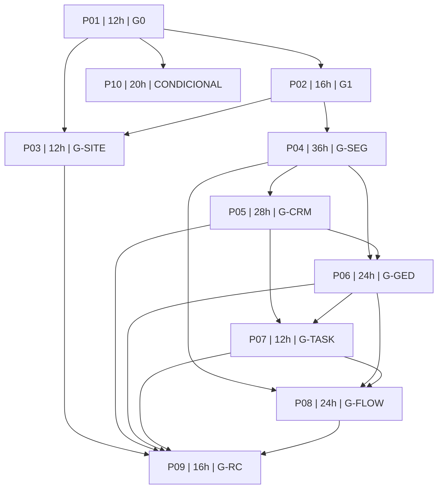

# Dependências, ordem de esforço e gates

O grafo é funcional; a tabela é a ordem padrão de consumo da capacidade de uma pessoa. A reserva não é etapa serial obrigatória.

| Fase | Gate real | Entrada de fases | Horas | Esforço cumulativo |
|---|---|---|---:|---:|
| [P01](fases/P01.md) | G0 | nenhuma | 12h | 12h |
| [P02](fases/P02.md) | G1 | P01 | 16h | 28h |
| [P03](fases/P03.md) | G-SITE | P01, P02 | 12h | 40h |
| [P04](fases/P04.md) | G-SEG | P02 | 36h | 76h |
| [P05](fases/P05.md) | G-CRM | P04 | 28h | 104h |
| [P06](fases/P06.md) | G-GED | P04, P05 | 24h | 128h |
| [P07](fases/P07.md) | G-TASK | P05, P06 | 12h | 140h |
| [P08](fases/P08.md) | G-FLOW | P04, P06, P07 | 24h | 164h |
| [P09](fases/P09.md) | G-RC | P03, P05, P06, P07, P08 | 16h | 180h |
| [P10](fases/P10.md) | CONDICIONAL | P01 | 20h | 200h |

P03 não depende de P04: site pode avançar durante impedimento do onboarding. P09 integra todos os gates do recorte que permaneceu no ciclo. Retirada de P08 exige atualizar candidato/dependências/escopo explicitamente, sem declarar G-FLOW passado.
