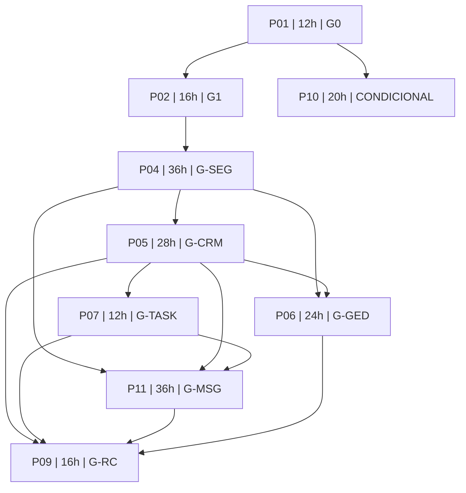

# Dependências, ordem de esforço e gates

O grafo é funcional; a tabela é a ordem padrão de consumo da capacidade de uma pessoa. A reserva não é etapa serial obrigatória.

| Fase | Gate real | Entrada de fases | Horas | Esforço cumulativo |
|---|---|---|---:|---:|
| [P01](fases/P01.md) | G0 | nenhuma | 12h | 12h |
| [P02](fases/P02.md) | G1 | P01 | 16h | 28h |
| [P04](fases/P04.md) | G-SEG | P02 | 36h | 64h |
| [P05](fases/P05.md) | G-CRM | P04 | 28h | 92h |
| [P07](fases/P07.md) | G-TASK | P05 | 12h | 104h |
| [P11](fases/P11.md) | G-MSG | P04, P05, P07 | 36h | 140h |
| [P06](fases/P06.md) | G-GED | P04, P05 | 24h | 164h |
| [P09](fases/P09.md) | G-RC | P05, P07, P11, P06 | 16h | 180h |
| [P10](fases/P10.md) | CONDICIONAL | P01 | 20h | 200h |

P07 depende do CRM e da segurança vigente, sem exigir GED para tarefa do contato. P11 fecha comunicação antes de P06; P09 integra os gates do Connect/comunicação/documentos. Site P03 e Flow P08 estão adiados fora das 200h, sem gate declarado aprovado.
